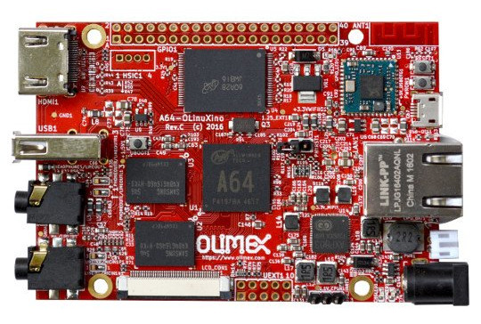

# Generic A64-OLinuXino Support

[](https://circleci.com/gh/pavels/nerves_system_a64_olinuxino)
[](https://hex.pm/packages/nerves_system_a64_olinuxino)

This is the base Nerves System configuration for the [A64-OLinuXino](https://www.olimex.com/Products/OLinuXino/A64/A64-OLinuXino)



| Feature              | Description                     |
| -------------------- | ------------------------------- |
| CPU                  | Allwinner A64 - 1.2 GHz Quad-Core ARM Cortex-A53 64-bit             |
| Memory               | 1GB or 2GB RAM DDR3L @ 672Mhz   |
| Storage              | MicroSD (eMMC not supported)    |
| Linux kernel         | 5.2 mainline                    |
| IEx terminal         | UART `ttyS0`                    |
| GPIO, I2C, SPI       | Yes, I2C and SPI on UEXT        |
| ADC                  | No                              |
| PWM                  | Yes, but only software          |
| UART                 | ttyS0 + ttyS2 on UEXT           |
| Camera               | None                            |
| Ethernet             | Yes                             |
| WiFi                 | RTL8723BS on board (some board configurations). Other requires USB WiFi dongle/driver |
| HW Watchdog          | sunxi watchdog available        |
| Power Management     | AXP803 driver available - support for battery and ac charger status        |

## Using

The most common way of using this Nerves System is create a project with `mix
nerves.new` and to export `MIX_TARGET=a64_olinuxino`. See the [Getting started
guide](https://hexdocs.pm/nerves/getting-started.html#creating-a-new-nerves-app)
for more information.

If you need custom modifications to this system for your device, clone this
repository and update as described in [Making custom
systems](https://hexdocs.pm/nerves/systems.html#customizing-your-own-nerves-system)

If you're new to Nerves, check out the
[nerves_init_gadget](https://github.com/nerves-project/nerves_init_gadget)
project for creating a starter project. It will get you started with the basics
like bringing up networking, initializing the writable application data
partition, and enabling ssh-based firmware updates.  It's easiest to begin by
using the wired Ethernet interface 'eth0' and DHCP.

## Console access

The console is configured to output to the 6 pin header on the
A64-OLinuXino that's labeled `DBG_UART`. A 3.3V FTDI cable is needed to access the output.

## Provisioning devices

This system supports storing provisioning information in a small key-value store
outside of any filesystem. Provisioning is an optional step and reasonable
defaults are provided if this is missing.

Provisioning information can be queried using the Nerves.Runtime KV store's
[`Nerves.Runtime.KV.get/1`](https://hexdocs.pm/nerves_runtime/Nerves.Runtime.KV.html#get/1)
function.

Keys used by this system are:

Key                    | Example Value     | Description
:--------------------- | :---------------- | :----------
`nerves_serial_number` | `"12345678"`      | By default, this string is used to create unique hostnames and Erlang node names. If unset, it defaults to part of the Etherner MAC Address.

The normal procedure would be to set these keys once in manufacturing or before
deployment and then leave them alone.

For example, to provision a serial number on a running device, run the following
and reboot:

```elixir
iex> cmd("fw_setenv nerves_serial_number 12345678")
```

This system supports setting the serial number offline. To do this, set the
`NERVES_SERIAL_NUMBER` environment variable when burning the firmware. If you're
programming MicroSD cards using `fwup`, the commandline is:

```sh
sudo NERVES_SERIAL_NUMBER=12345678 fwup path_to_firmware.fw
```

Serial numbers are stored on the MicroSD card so if the MicroSD card is
replaced, the serial number will need to be reprogrammed. The numbers are stored
in a U-boot environment block. This is a special region that is separate from
the application partition so reformatting the application partition will not
lose the serial number or any other data stored in this block.

Additional key value pairs can be provisioned by overriding the default provisioning.conf
file location by setting the environment variable
`NERVES_PROVISIONING=/path/to/provisioning.conf`. The default provisioning.conf
will set the `nerves_serial_number`, if you override the location to this file,
you will be responsible for setting this yourself.

## UEXT

All parts of `UEXT` port are enabled and supported.

SPI is on `/dev/spidev0.0`

I2c is on `/dev/i2c-0` - you can use `i2cdetect -y 0` to check what is on the i2c bus

UART is on `/dev/ttyS2`

## SPI

The following examples shows how to get SPI0 functional in Elixir. SPI0 port is on `UEXT` header.

Verify that the device drivers are loaded and read spi0 transfers:

```elixir
iex(11)> cmd("ls /dev/spi*")
/dev/spidev0.0

iex(12)> File.read "/sys/bus/spi/devices/spi0.0/statistics/transfers"
{:ok, "0"}
```

If you have included [circuits_spi](https://github.com/elixir-circuits/circuits_spi) as a
dependency, you can start it now and test a transfer:

> The example below should work without any additional hardware connected to the
> OLinuXino. If you have SPI hardware connected to the OLinuXino, your returned binary might
> be different.

```elixir
iex(13)> {:ok, ref} = Circuits.SPI.open("spidev0.0")
{:ok, #Reference<...>}
iex(14)> Circuits.SPI.transfer(ref, <<1,2,3,4>>)
<<255, 255, 255, 255>>
```

## PWM

A64 CPU has only one Hardware PWM channel and it collides with debug UART pins. Therefore this system uses Software PWM kernel module, which enables Software PWM on nearly all GPIO pins. CHek it;s documentation at [https://github.com/pavels/a64servo](https://github.com/pavels/a64servo).

To use it first initialize it by calling
```elixir
System.cmd("servo.sh", ["load"])
```
in target initialization.

## Audio

Onboard audio input and output is supported and is set as default in ALSA.

To use it, you first need to enable it.

To enable output execute:

```elixir
System.cmd("amixer", ["-q", "sset", "AIF1 Slot 0 Digital DAC", "on"])
System.cmd("amixer", ["-q", "sset", "Headphone", "100%", "on"])
```

To enable microphone input execute
```elixir
System.cmd("amixer", ["-q", "sset", "AIF1 Data Digital ADC", "cap", "on"])
System.cmd("amixer", ["-q", "sset", "Mic1", "43%", "cap", "on"])
```

You can use `sox` package programs `play` and `rec` for audio input/output.

## Supported WiFi devices

Some boards has built in RTL8723BS. This module is not always very reliable and the signal strength is problematic due to on board antenna design.

Various USB WIFI dongle are supported. Recommended and tested ones are USB adapters supported by `rt2800usb` driver (Ralink RT2070, RT2770, RT2870, RT3070, RT3071, RT3072, RT3370, RT3572, RT5370, RT5372, RT5572).

## Bluetooth

The A64-OLinuXino boards with built-in WiFi support use the RTL8723BS module.
This is a combo WiFi/Bluetooth module. Bluetooth is not well supported in
Nerves. However, Nerves is built on Linux so you can enable and use `bluez`.
Another option is to use [harald](https://hex.pm/packages/harald) which can
communicate with the module using low level Bluetooth HCI commands.

## Installation

If you're new to Nerves, check out the
[nerves_init_gadget](https://github.com/fhunleth/nerves_init_gadget) project for
creating a starter project for the A64-OLinuXino boards.

It will get you started with the basics like bringing up the virtual Ethernet interface, initializing the application partition, and enabling ssh-based firmware updates.
